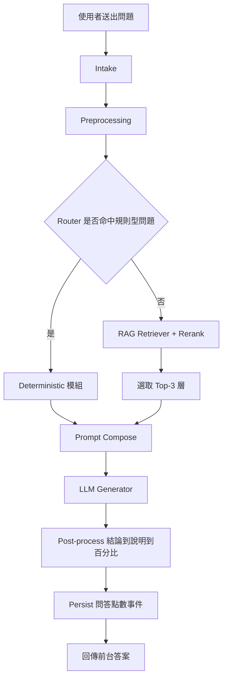
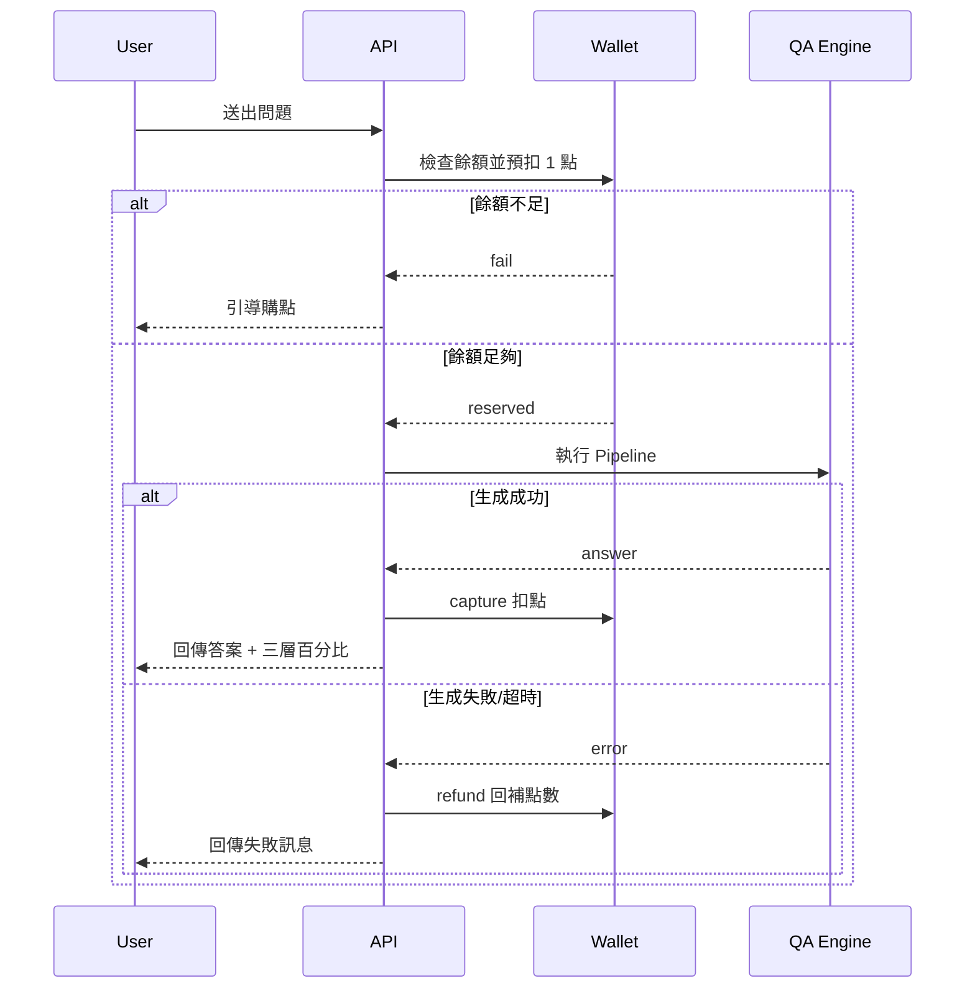

# ELIN 神域引擎 產品需求文件（PRD）

## 1. 文件資訊
- 產品名稱：ELIN 神域引擎
- 文件版本：v0.3（MVP）
- 文件目的：定義 ELIN 神域引擎網頁平台的核心需求、範圍與驗收標準，供產品、設計、工程與測試協作。

## 2. 產品願景與目標
ELIN 神域引擎是一個可互動問答平台。使用者註冊登入後可提出問題，系統透過 RAG（檢索增強生成）與 OpenAI API 回覆。平台採點數制，提問扣點、可購買點數。

MVP 目標：
- 讓新使用者可在 3 分鐘內完成註冊、登入與首次提問。
- 提供穩定、可追蹤的問答流程（含扣點與失敗回補）。
- 提供一致的回答格式（結論優先）與可理解的三層相關度百分比。
- 建立可營運的購點與點數消費閉環。

## 3. 目標使用者
- 一般使用者：希望快速取得可用解答。
- 進階使用者：重視答案可信度與回答結構一致性。
- 營運管理者（後台）：管理知識庫、使用者、點數與交易。

## 4. 產品範圍
### 4.1 In Scope（MVP）
- 帳號系統：Email 註冊、登入、登出、忘記密碼。
- 問答系統：輸入問題、取得回答、查詢歷史問答。
- AI 回答引擎：
  - 以 RAG 為主，檢索後僅採用最相關 Top-3 層作答。
  - 對「可驗證、不可模糊」規則可走 deterministic 規則模組。
  - RAG 命中不足時可降級為一般 OpenAI 回答。
- 回答輸出規則：
  - 前台只顯示「結論 → 必要說明 → 三層百分比（主層/輔層/參照層）」。
  - 不顯示內部演算法名稱、規則編號或推理細節。
- 點數系統：
  - 每次提問固定扣 1 點（不採動態計費）。
  - 餘額不足時禁止送出並引導購點。
  - 問答失敗（系統錯誤/超時）自動回補點數。
- 金流與購點：固定點數包購買與交易紀錄（1 題 168、3 題 358、5 題 518）。
- 延伸問題：系統提供延伸問題，使用者可先保存，啟用時再扣點。

### 4.2 Out of Scope（MVP 不含）
- 多語系完整本地化（MVP 以繁中為主）。
- 團隊/企業版權限。
- 模型微調與複雜推薦系統。
- 社群通路（FB/IG）深度整合。

## 5. 核心使用流程
### 5.1 使用者操作流程
1. 使用者註冊並完成 Email 驗證後登入。
2. 進入問答頁，查看點數餘額。
3. 輸入問題並送出。
4. 系統檢查點數足夠後預扣點數。
5. 系統完成回答後回傳標準格式（結論、說明、三層百分比）。
6. 成功則完成扣點；失敗則自動回補點數。
7. 使用者可查看歷史問答與點數流水；點數不足時可導購購點。

### 5.2 Hybrid Pipeline（1.1 核心邏輯）
1. Intake：接收提問內容與必要上下文（語言、模式、會員資訊）。
2. Preprocessing：進行輸入正規化（名稱、問題文本、基本映射）。
3. Router：判斷是否命中規則型問題；命中則走 deterministic 模組，否則走 RAG。
4. Retriever + Rerank：檢索知識庫並排序，固定選取 Top-3 層。
5. Prompt Compose：整合 Top-3 證據、輸出規範與使用者輸入。
6. Generator：由 LLM 生成答案草稿。
7. Post-process：轉為前台格式（結論→說明→三層百分比），隱藏內部規則/演算法名稱。
8. Persist：保存問答、扣點流水、事件日誌與可選延伸問題。

## 6. 功能需求（Functional Requirements）
### 6.1 帳號與身份驗證
- 支援 Email + 密碼註冊/登入。
- 密碼需符合最小安全規則（長度、複雜度）。
- 採 JWT 或 Session（需有過期與刷新策略）。
- 未完成 Email 驗證的帳號不得送出提問。

### 6.2 問答與知識檢索
- 問題字數上限（建議 1,000 字）。
- 問答流程需包含 Intake、Preprocessing、Router、Retriever、Generator、Post-process、Persist。
- RAG 檢索後僅輸出 Top-3 層結果（主層/輔層/參照層）。
- 百分比需可解釋且總和為 100。
- 回答需包含：回答內容、流程來源標記（RAG/規則/OpenAI）、時間戳。
- RAG 文件來源需可管理（上傳、更新、刪除；至少後台可操作）。

### 6.3 點數與交易
- 點數餘額查詢。
- 扣點、回補、購點流水可追蹤（含原因碼）。
- 提問採固定扣點：每次提問扣 1 點。
- 點數包售價：1 題 168、3 題 358、5 題 518。
- 購點訂單需保存狀態（待付款/成功/失敗/退款）。
- 交易與扣點需具冪等保護，避免重複扣點。

### 6.4 管理後台（最小可用）
- 使用者列表與基本查詢。
- 文件庫管理。
- 訂單與點數流水查詢。
- 問答流程觀測（請求量、失敗率、平均延遲）。

## 7. 非功能需求（NFR）
- 可用性：月可用率目標 99.5%。
- 效能：一般提問 95 百分位回應時間 < 12 秒。
- 安全：密碼雜湊、HTTPS、API Key 安全管理、Rate Limit、基本濫用防護。
- 稽核：扣點、回補、付款回調需可追溯且不可竄改。
- 隱私：個資最小化蒐集與刪除機制。

## 8. 資料與事件（建議）
- 核心資料表：`users`、`sessions`、`questions`、`answers`、`credit_wallets`、`credit_transactions`、`orders`、`kb_documents`、`followups`。
- 關鍵事件：`question_submitted`、`credit_reserved`、`answer_generated`、`credit_captured`、`credit_refunded`、`order_paid`、`followup_saved`、`followup_used`。

## 9. 驗收標準（MVP）
- 新使用者需完成 Email 驗證後，方可成功提問。
- 每次提問皆正確扣點；失敗情境可正確回補。
- Router 可正確分流規則型與一般問題（可由後台日誌驗證）。
- 回答格式固定為「結論→說明→三層百分比」，且百分比合計為 100。
- 前台不顯示內部演算法名稱或規則編號。
- 前台不顯示參考來源摘要。
- 購點成功後 10 秒內反映餘額。
- 歷史頁可查到完整問答與交易紀錄。
- 後台調整文件後，可影響後續 RAG 回答內容。

## 10. 風險與依賴
- 依賴 OpenAI API 可用性與成本波動。
- 依賴外部金流穩定性與回調正確性。
- RAG 文件品質直接影響回答準確度。
- 規則模組與 RAG 結果衝突時，需明確定義優先級。
