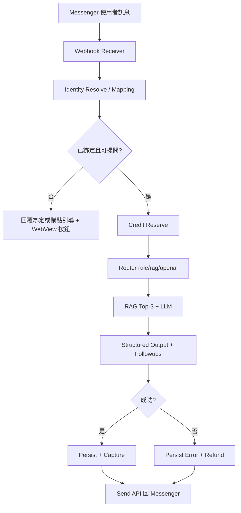
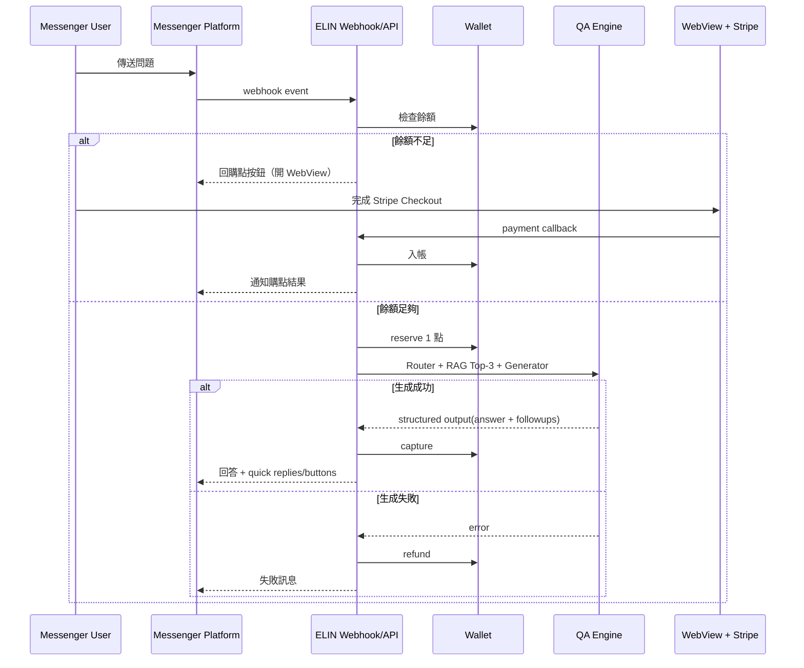

# ELIN 神域引擎 產品需求文件（PRD）

## 1. 文件資訊
- 產品名稱：ELIN 神域引擎
- 文件版本：v0.17（Messenger-first WebView Home Hub）
- 文件目的：定義 ELIN 神域引擎以 Messenger 為主入口的核心需求、範圍與驗收標準，供產品、設計、工程與測試協作。

## 2. 產品願景與目標
ELIN 神域引擎是一個以 AI 問答為核心的點數制服務。產品以 Facebook Messenger 作為主要使用者入口，透過 webhook 接收訊息並回覆結果；註冊/帳號綁定/付款等需要頁面操作的流程，透過 Messenger WebView 完成。

MVP 目標：
- 讓新使用者可在 Messenger 對話中於 3 分鐘內完成首次提問並收到回覆。
- 提供穩定、可追蹤的問答與扣點流程（reserve/capture/refund）。
- 提供一致且可程式化處理的回答格式（structured output，結論優先）。
- 建立可營運的 Messenger 導購購點閉環（WebView Stripe Checkout + 回流 Messenger）。

## 3. 目標使用者
- 一般使用者：主要在 Messenger 對話中提問與追問，希望快速取得可用答案。
- 進階使用者：重視答案一致性、可追溯性，以及帳號綁定後的歷史/點數一致性。
- 營運管理者（後台）：管理知識庫、使用者、點數、訂單與通路事件。

## 4. 產品範圍
### 4.1 In Scope（MVP）
- Messenger 主入口：
  - 支援 Messenger webhook verification 與 webhook event handling。
  - 支援 Messenger outbound message delivery（文字、quick replies/buttons）。
  - 支援 Messenger persistent menu，提供常用入口（如點數、購點、歷史）。
- 身份與綁定：
  - 支援 Messenger 身份（PSID / external identity）建檔與對應。
  - 使用者可先以未綁定狀態互動，必要時透過 Messenger WebView 完成站內帳號建立/綁定。
  - MVP 以 Messenger 為唯一主身份來源；不要求 Email 驗證，也不提供獨立 Web 註冊/登入作為主流程。
  - 已綁定使用者可在 WebView 維護固定問答參數（姓名、母親姓名），供後續提問自動帶入。
- 問答系統：
  - 使用者可直接在 Messenger 發問並收到回覆。
  - 保留 RAG 為主、Router（rule/rag/openai）分流、structured output、followups。
  - 系統需在 ask 前自動將使用者固定問答參數與本次問題組裝後再送入模型，但歷史紀錄只保留原始問題文字。
- 回答輸出規則：
  - 前台（Messenger）顯示「結論 → 必要說明」。
  - 不顯示內部演算法名稱、規則編號、來源/request id/三層比例。
- 點數系統：
  - 每次提問固定扣 1 點（不採動態計費）。
  - 餘額不足時，在 Messenger 內引導購點（開啟 WebView）。
  - 問答失敗（系統錯誤/超時）自動回補點數。
- 金流與購點：
  - 固定點數包（1 題 168、3 題 358、5 題 518）。
  - 主要透過 Messenger WebView 開啟 Stripe Checkout。
  - 付款結果需同步更新訂單/點數，並回饋至 Messenger 對話。
- 延伸問題（Followups）：
  - 每次回答尾端提供 0 至 3 個延伸問題選項（Messenger quick replies/buttons）。
  - 延伸問題必須是可直接點擊送出的完整追問，不可要求使用者先做選擇或補資料。
  - 點擊任一選項視為同主題新提問，立即扣 1 點。
  - 一個問題可有 0 個或任意多個延伸問題（不限制層數）。
- 輔助 Web 與後台：
  - Web 獨立站僅保留為 Messenger 配套入口與 WebView 容器。
  - Web 不提供獨立提問頁作為主流程；真正提問入口維持在 Messenger 對話內。
  - 後台保留使用者、文件庫、訂單/點數流水與流程觀測。

### 4.2 Out of Scope（MVP 不含）
- IG 與其他社群平台的多通路同步整合。
- 複雜 growth automation（行銷旅程自動化、進階漏斗編排）。
- 進階 CRM / segmentation / campaign orchestration。
- 完整企業版權限與多租戶能力。
- 模型微調與複雜推薦系統。

### 4.3 MVP 假設與待確認
- MVP 先以單一 Facebook Page / 單一 Messenger 通路為主。
- WebView 帳號綁定流程以最小可用版本優先，首次 session 由聊天室內 linking button 建立；persistent menu 的 `購點/歷史` 入口採 postback bridge，再回一顆帶 signed token 的 WebView 按鈕。
- Stripe Checkout 成功/失敗回傳以可觀測、可重試與冪等為前提；更進階財務對帳流程後續補強。
- 對外公開試用的 release gate 不只包含 deploy 成功，也包含 Meta app 已完成對應 review / advanced access 與公開化設定，讓非 app role 的一般使用者可實際與 bot 互動。

## 5. 核心使用流程
### 5.1 主要 User Journeys
1. 新使用者首次提問（未綁定）
   - 使用者在 Messenger 傳送問題。
   - 系統透過 webhook 接收事件，建立/更新 Messenger identity。
   - 若策略允許，先提供最小回覆；若需完整服務（如歷史保存/購點）則引導 WebView 綁定。

2. 點數不足導購
   - 使用者在 Messenger 提問時餘額不足。
   - 系統回覆點數不足訊息與購點按鈕。
   - 若是直接提問遇到點數不足，系統需保留該問題，讓使用者購點後可在 Messenger 一鍵重送。
   - 點擊後開啟 Messenger WebView，導向 Stripe Checkout。

3. WebView 付款後返回 Messenger
   - 使用者在 WebView 完成付款。
   - 系統接收支付結果，更新訂單與點數餘額。
   - 系統回 Messenger 通知購點成功/失敗與可用點數。

4. 延伸問題追問
   - 回答尾端提供 0..3 個 quick replies/buttons。
   - 使用者點擊任一選項後，系統以同主題發起子問答並扣 1 點。

5. 已綁定 vs 未綁定能力
   - 未綁定：可進行有限互動（由產品策略決定），必要時被引導綁定。
   - 已綁定：可使用完整問答、購點、歷史與點數一致性能力。
   - 若已綁定但尚未完成固定問答參數設定，系統需先引導完成設定後才能提問。
   - 若使用者在 Messenger 直接提問時被固定問答參數 gate 擋下，系統需保留該問題，讓使用者完成設定後可在 Messenger 一鍵重送。

6. 常用功能入口
   - 使用者可透過 Messenger persistent menu 隨時查詢剩餘點數。
   - 使用者可透過 Messenger persistent menu 觸發購點頁與歷史頁 bridge，再開啟對應 WebView。
   - 若尚未綁定帳號或 WebView session 已失效，系統需回覆一顆可重新建立 session 並導到目標頁的按鈕，而不是讓頁面停在無法前進的 `session required` 狀態。

### 5.2 Messenger-first 問答流程
1. Intake：接收 Messenger 訊息事件（text/postback/quick reply）與 channel context。
2. Identity Resolve：以 PSID/page_id 查找 external identity，必要時建立。
3. Eligibility Check：判斷是否可直接回答、是否需綁定或導購。
4. Credit Reserve：可提問時先預扣 1 點（reserve）。
5. Router：判斷 rule/rag/openai 路徑。
6. Retriever + Rerank：RAG 檢索並固定選取 Top-3。
7. Generator：LLM 生成答案草稿。
8. Post-process：轉為 structured output（answer + followup options）。
9. Persist：保存問答、followup 關聯、交易與事件。
10. Credit Capture/Refund：成功 capture，失敗 refund。
11. Outbound Delivery：將回答與 followup 按鈕回傳至 Messenger。

## 6. 功能需求（Functional Requirements）
### 6.1 通路與身份
- 系統需支援 Messenger webhook verification（challenge 驗證）。
- 系統需支援 webhook event handling（message/postback/quick reply）。
- 系統需支援 Messenger persistent menu / postback 常用入口（如查點數）。
- 對需要站內 session 的 persistent menu 入口（例如購點、歷史），系統需支援 postback bridge，再回帶 signed token 的 WebView 按鈕。
- 系統正式公開前，需完成 Meta app 對應的 review / advanced access / publish 流程，避免功能只對 `Administrators / Developers / Testers` 可用。
- 系統需維護 Messenger 身份映射（external identity：PSID/page_id）與站內 user 的綁定關係。
- 系統需允許「尚未綁定站內帳號」狀態存在，且有明確能力邊界與引導流程。
- 帳號綁定與 WebView session 建立需可透過 Messenger WebView 完成。
- 系統需提供已綁定使用者維護固定問答參數的 WebView 設定頁。

### 6.2 問答與知識檢索
- 問題字數上限（建議 1,000 字）。
- 問答流程需包含 Intake、Identity Resolve、Router、Retriever、Generator、Post-process、Persist。
- ask runtime 需在 generator 前自動注入使用者固定資料（至少姓名、母親姓名）。
- RAG 檢索後內部固定採用 Top-3 證據作答。
- 回答需以 structured output 回傳，至少包含：回答內容、延伸問題選項。
- 流程 metadata（來源標記、request id、檢索分數）作為後端觀測資料，不在 Messenger 前台顯示。
- `questions` / 歷史頁僅保存本次原始提問，不直接保存拼接後含個資的完整 prompt。
- 回答尾端需產生 0..3 個延伸問題選項，並可映射為 Messenger quick replies/buttons。
- 延伸問題應直接代表「下一個值得追問的完整問題」，避免問卷式選項、資料蒐集式選項或半句片段。

### 6.3 點數與交易
- 點數餘額查詢。
- 扣點、回補、購點流水可追蹤（含原因碼）。
- 提問採固定扣點：每次提問扣 1 點。
- 交易與扣點需具冪等保護，避免重複扣點或重複入帳。
- 延伸問題點擊視為一次新提問，套用同一扣點與回補規則（每次 1 點）。
- 已綁定使用者需可從 Messenger 常駐入口主動查詢剩餘點數。

### 6.4 購點與金流（Messenger WebView）
- 點數包售價：1 題 168、3 題 358、5 題 518。
- 購點主要入口在 Messenger 對話中觸發，付款在 Messenger WebView 內完成 Stripe Checkout。
- 使用者需可從 Messenger persistent menu 主動開啟購點 WebView。
- 付款完成後需更新訂單狀態與點數餘額，並回 Messenger 告知結果。
- 付款失敗/逾時需回 Messenger 告知重試路徑。

### 6.5 管理後台（最小可用）
- 使用者列表與基本查詢（含 external identity 綁定狀態）。
- 文件庫管理（上傳、更新、刪除）。
- 訂單與點數流水查詢。
- 問答流程觀測（請求量、失敗率、平均延遲、通路事件）。

## 7. 非功能需求（NFR）
- 可用性：月可用率目標 99.5%。
- 效能：一般提問 95 百分位回應時間 < 12 秒。
- 安全：密碼雜湊、HTTPS、API Key 安全管理、Rate Limit、基本濫用防護。
- 通路安全：Webhook signature 驗證、回調來源校驗、事件重放防護（逐步落地）。
- 稽核：扣點、回補、付款回調、訊息發送需可追溯且不可竄改。
- 隱私：個資最小化蒐集與刪除機制。
- 開發穩定性（DevX）：本機 `git commit` 不應導致 docker backend 因檔案監看誤觸發而 shutdown/reload；`--reload` 監看範圍需限縮到應用程式碼目錄（例如 `app/`），並排除 `.venv`。

## 8. 資料與事件（建議）
- 核心資料表（PRD 層級）：
  - `users`、`sessions`、`questions`、`answers`、`credit_wallets`、`credit_transactions`、`orders`、`kb_documents`、`followups`
  - `external_identities`（或 `messenger_accounts`，用於 PSID/page_id 與 internal user 對應）
- 關鍵事件：
  - `webhook_received`
  - `identity_resolved`
  - `account_linked`
  - `question_submitted`
  - `credit_reserved`
  - `answer_generated`
  - `message_sent`
  - `credit_captured`
  - `credit_refunded`
  - `checkout_started`
  - `payment_webhook_received`
  - `checkout_completed`
  - `followup_rendered`
  - `followup_clicked`
  - `followup_answer_generated`

## 9. 驗收標準（MVP）
- 使用者可直接從 Messenger 成功提問並收到回答。
- 使用者可從 Messenger persistent menu 主動查詢剩餘點數，且結果與錢包資料一致。
- 針對已綁定帳號使用者，每次提問皆正確扣點；失敗情境可正確回補。
- 點數不足時，Messenger 內可被正確引導至 WebView 購點流程。
- 直接提問遇到點數不足時，購點後可從 Messenger 一鍵重送剛剛的問題。
- Stripe Checkout 完成後，點數與訂單狀態可在可接受時間內（建議 10 秒）反映，並回傳 Messenger 成功/失敗訊息。
- 回答格式固定為「結論→說明」，並由 structured output 保證欄位一致。
- 前台（Messenger）不顯示內部演算法名稱、規則編號、來源摘要、request id、三層比例。
- 回答尾端依回傳顯示 0..3 個延伸問題按鈕（若多於 1 個則內容互異，且 Messenger 不應重複顯示兩組內容相近的延伸問題文字）。
- 點擊任一延伸問題按鈕後，需新增同主題子問答並正確扣 1 點（失敗可回補）。
- 已綁定帳號者，其歷史問答與點數流水需維持一致性與可追溯性。
- 後台調整文件後，可影響後續 RAG 回答內容。

## 10. 風險與依賴
- 依賴 OpenAI API 可用性與成本波動。
- 依賴 Stripe 與支付回調穩定性與正確性。
- 依賴 Meta Messenger 平台可用性、政策與 API 變更。
- 若 Meta app 仍停留在 role-only 測試模式，或 `pages_messaging` 等必要能力尚未完成 review / advanced access，非 app role 使用者將無法實際試用 bot。
- RAG 文件品質直接影響回答準確度。
- 規則模組與 RAG 結果衝突時，需明確定義優先級。
