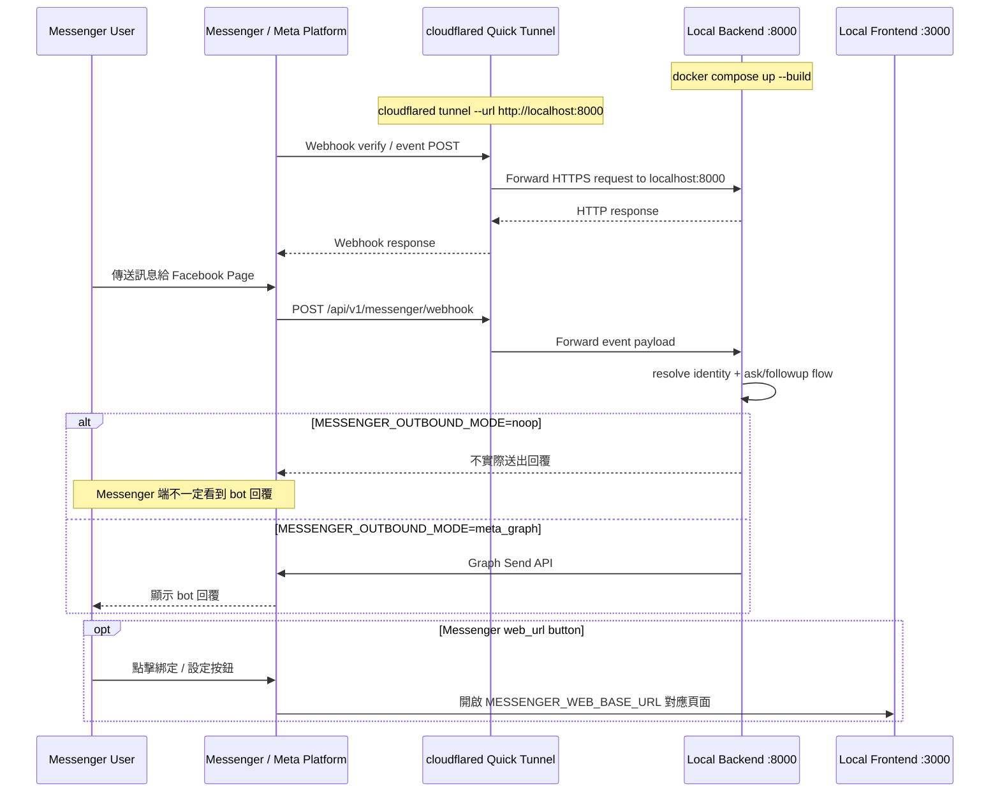
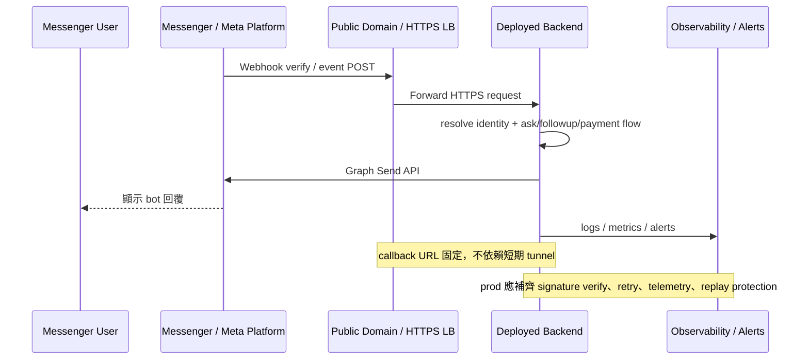

# Messenger Validation Runbook

## 說明
本文件說明 ELIN 神域引擎在 `local`、`pre-prod`、`prod` 三個階段應如何驗證 Messenger flow，包含 webhook 綁定、前置設定、驗證案例與常見排錯方式。

適用對象：
- 開發者：確認 webhook、event ingest、outbound reply 與 channel mapping 是否正常
- QA：依環境分級執行一致的人工驗證
- 部署/營運：確認 pre-prod 與 prod 的通路設定、權限與風險控管

## 目前實作邊界
已完成：
- `GET /api/v1/messenger/webhook` challenge verify
- `POST /api/v1/messenger/webhook` event ingest
- Messenger greeting / `Get Started` welcome onboarding
- linked / unlinked identity 分流
- linked user 的 inbound ask flow
- linked user 的固定問答參數 gating（姓名 / 母親姓名未完成時先引導 `/settings`）
- Messenger quick reply followup flow
- Messenger persistent menu（查看剩餘點數 / 前往設定）
- Messenger WebView session bootstrap（`POST /api/v1/messenger/link`）
- `noop` / `meta_graph` outbound client abstraction

尚未完成：
- Messenger WebView Stripe Checkout 流程
- payment webhook -> 訂單入帳 -> Messenger 回饋閉環
- production-ready Graph Send API retry / telemetry
- webhook signature replay protection 與完整 hardening

因此：
- `local` 與 `pre-prod` 目前可完整驗證 webhook、ask、followup、linked/unlinked routing、Messenger WebView session bootstrap
- `local` 與 `pre-prod` 目前也可驗證固定問答參數設定與 profile-required 引導
- 涉及 WebView payment 的驗證，目前只能驗證前置條件與未來驗證入口，不能宣稱已完成閉環

## Repo 實際設定對照
Backend endpoint：
- `GET /api/v1/messenger/webhook`
- `POST /api/v1/messenger/webhook`

主要環境變數：
- `MESSENGER_ENABLED=true`：啟用 Messenger webhook route
- `META_VERIFY_TOKEN=...`：Meta webhook verify token
- `MESSENGER_OUTBOUND_MODE=noop|meta_graph`：控制 outbound 是否真的送到 Meta
- `META_PAGE_ACCESS_TOKEN=...`：`meta_graph` 模式必填
- `MESSENGER_VERIFY_SIGNATURE=true|false`：是否驗 webhook signature
- `META_APP_SECRET=...`：開啟 signature 驗證時使用
- `MESSENGER_WEB_BASE_URL=...`：Messenger web_url button 會打開的前端 / WebView base URL
- `CORS_ORIGINS=...`：backend 允許的 browser origins；若要從 Messenger WebView 的 frontend tunnel 呼叫 backend API，必須包含該 frontend 公開網址

觀念區分：
- `MESSENGER_OUTBOUND_MODE=noop`：可驗證 webhook 有沒有打進 backend，但 Messenger 不會收到系統回覆
- `MESSENGER_OUTBOUND_MODE=meta_graph`：才會真的透過 Meta Graph API 回 Messenger 訊息
- backend tunnel URL 變了：更新 Meta 後台 webhook callback URL
- frontend tunnel URL 變了：更新 `MESSENGER_WEB_BASE_URL` 與 `CORS_ORIGINS`，通常不需要改 Meta 後台

## Persistent Menu
目前 repo 已支援一套最小可用的 Messenger persistent menu：

- `查看剩餘點數`：postback `SHOW_BALANCE`
- `前往設定`：postback `OPEN_SETTINGS`

同步方式：
```bash
cd /Users/kevin1kevin1k/cyber-oracle/backend && uv run python scripts/sync_messenger_profile.py && cd ..
```

預期結果：
- script 會同時設定 `greeting`、`Get Started` 與 `persistent_menu`；Meta 不接受只設定 persistent menu
- Meta Page 的 Messenger persistent menu 會被更新為目前程式內定義的預設 menu
- 新使用者第一次打開對話視窗時，可先看到 welcome greeting 與 `Get Started`
- 已綁定使用者點 `查看剩餘點數` 時，會直接收到目前剩餘點數
- 若剩餘點數為 `0`，系統會回覆目前體驗點數不足的對應提示
- 未綁定使用者點 `查看剩餘點數` 時，會回既有 linking 引導
- `前往設定` 會先走 postback bridge，再回一顆帶 signed token 的 WebView 按鈕
- 因此即使使用者尚未建立 WebView session，也能從 persistent menu 自救，不必先手動找回原本的 linking button
- 若 linked user 尚未完成固定問答參數，Messenger 會回一個導向 `/settings?from=messenger-profile-required` 的 WebView 按鈕，並保留原問題供使用者完成設定後一鍵重送
- ask / followup / replay 這類較慢的流程，會先出現 `mark_seen` / `typing_on` 的處理中回饋，正式答案送出前再 `typing_off`
- 主問題 / followup / replay 成功後，系統會再補一則 `本次已扣 1 點，目前剩餘 X 點。`，因此手機版即使不明顯顯示 persistent menu，使用者仍可即時得知餘額

## 通訊流程圖

### Local 開發驗證（目前）


### Pre-prod / Prod（未來固定網域）


## 環境分級與驗證目標

### Local
適用情境：
- 開發中快速驗證 webhook、event parse、identity resolve、ask/followup flow

是否需要 deploy：
- 不需要正式 deploy
- 但需要公開 HTTPS URL，因此仍要用 tunnel（例如 Cloudflare Tunnel）把本機 `:8000` 暴露出去

目標：
- webhook challenge verify 成功
- message event 可打進 backend
- linked / unlinked user 行為正確
- quick reply followup 可正確進 ask domain

### Pre-prod
適用情境：
- 在接近 production 的固定網域、固定 Page、固定 App 上驗證通路穩定性

是否需要 deploy：
- 需要 deploy 到 staging / pre-prod 環境
- 不建議再用短期 tunnel URL，因為 webhook callback URL、Page 綁定與測試流程都需要穩定網址

目標：
- 固定網域 webhook 綁定與 re-deploy 後穩定可用
- `meta_graph` outbound 真實回覆可成功送出
- 驗證 app roles / page subscription / secrets 配置正確
- 驗證觀測、錯誤處理與手動排障流程

### Prod
適用情境：
- 正式上線後的切換驗證與 incident 排查

是否需要 deploy：
- 是

目標：
- 正式 webhook / Page / App / secrets 全部正確
- 正式 outbound message delivery 正常
- signature verify、監控告警、重試與營運排障入口齊備
- 正式用戶行為與綁定/體驗版點數策略一致
- 非 app role 的一般 Facebook 使用者也能完成同樣的主流程驗證

## Webhook 綁定步驟
1. 啟動 backend，並確認 `MESSENGER_ENABLED=true`
2. 準備 callback URL
   - local：使用 tunnel，例如 `https://xxxxx.trycloudflare.com/api/v1/messenger/webhook`
   - pre-prod / prod：使用固定 HTTPS 網域
3. 在 Meta Developers 後台找到 Messenger webhook 設定頁
4. 填入：
   - Callback URL：`https://<your-domain>/api/v1/messenger/webhook`
   - Verify Token：與 backend `META_VERIFY_TOKEN` 完全一致
5. 按 `Verify and Save`
6. 將目標 Facebook Page 訂閱到這組 webhook
7. 至少訂閱：
   - `messages`
   - `messaging_postbacks`

補充：
- quick reply 事件會跟著 message event 進來，不需要另一條專用 webhook route
- 若 App 還在 development mode，通常只有 app 的 admin / developer / tester 能實際測 bot
- 若目標是讓所有人都可試用，需另外完成 Messenger 對應的 review / advanced access 與公開化設定；不能把 app roles 當成公開上線方案

## 對外公開試用前的 Meta 檢查
在 `prod` 之前，先把這些項目當成 release gate：

1. Meta app 已完成公開化前置資料
   - `Settings > Basic` 的 App Icon、Privacy Policy URL、聯絡資訊已補齊
   - 若 dashboard 要求資料刪除說明 / Terms URL，也一併補齊
2. Meta app 已完成 Messenger 對應 review / advanced access
   - 至少確認 `pages_messaging`
   - 並檢查 dashboard 是否同時要求 `pages_show_list`、`pages_manage_metadata`
3. 已確認 app 目前的公開切換方式
   - 傳統 app 常見是 `Development -> Live`
   - Business app 可能改以 access levels 表示
   - 不論 UI 名稱，目標都一樣：非 role 使用者可實際與 bot 互動
4. Facebook Page 本身可被公開互動
   - 已發布
   - Messenger 已開啟
   - 沒有年齡 / 國家限制把試用者擋掉

## Cloudflared（Local 測試必備）
對目前這個 repo 來說，local Messenger webhook 測試最簡單的做法，就是使用 `cloudflared` 開一條 quick tunnel，把本機 `http://localhost:8000` 暴露成公開 HTTPS URL。

### 什麼情況需要 `cloudflared`
你需要 `cloudflared` 的情況：
- backend 跑在本機或 docker compose
- 你想在 local 直接測 Meta webhook verify
- 你還不想先 deploy 到 pre-prod / prod

你不需要先準備完整 Cloudflare 網域代管的情況：
- 只做 local 開發驗證
- 使用 `trycloudflare.com` 的 quick tunnel 即可

### Intel Mac 安裝方式
若你還沒安裝：
```bash
brew install cloudflared
```

確認安裝成功：
```bash
cloudflared --version
```

### Quick Tunnel 啟動方式
先確認 backend 已在 host 的 `localhost:8000` 可達，再執行 tunnel。

最小檢查指令：
```bash
curl -i http://localhost:8000/api/v1/health
```

預期結果：
- HTTP status 為 `200`
- response body 類似：
```json
{"status":"ok"}
```

如果你是用 Docker Compose，也可以先補查容器狀態：
```bash
cd /Users/kevin1kevin1k/cyber-oracle && docker compose ps && cd ..
```

預期結果：
- `backend` container 為 `running`
- `3000` / `8000` / `5432` 等服務狀態正常

確認以上都正常後，再執行：
```bash
cloudflared tunnel --url http://localhost:8000
```

若你要測 Messenger WebView 按鈕（綁定 / 購點），還需要第二條 frontend tunnel：
```bash
cloudflared tunnel --url http://localhost:3000
```

成功後，將 frontend 那條公開網址寫進 backend：
```env
MESSENGER_WEB_BASE_URL=https://xxxxx.trycloudflare.com
CORS_ORIGINS=http://localhost:3000,https://xxxxx.trycloudflare.com
```

注意：
- backend webhook callback URL 與 frontend WebView URL 可以是兩條不同 tunnel
- webhook 用的是 backend tunnel
- web_url button 用的是 `MESSENGER_WEB_BASE_URL`
- frontend tunnel 若不在 `CORS_ORIGINS` 內，Messenger WebView 中的瀏覽器 preflight (`OPTIONS`) 會被 backend 擋掉，常見症狀是綁定頁出現 `Failed to fetch`

成功後，終端機通常會顯示一個像這樣的網址：
```text
https://xxxxx.trycloudflare.com
```

你要把這個網址組成 webhook callback URL：
```text
https://xxxxx.trycloudflare.com/api/v1/messenger/webhook
```

### 使用注意事項
1. 這種 quick tunnel URL 通常是短期的
   - 每次重開 `cloudflared`，網址可能都會變
   - 一旦網址變了，你要回 Meta 後台重新更新 Callback URL
2. 開 tunnel 的那個 terminal session 不能先關掉
   - 關掉後，Meta 就打不到你的 webhook
3. `cloudflared` 只負責把請求導到你本機
   - backend 本身還是要真的有在跑
   - `GET /api/v1/health` 要先通

### 啟動前最小檢查
先在本機確認 backend 正常：
```bash
curl http://localhost:8000/api/v1/health
```

再確認 Messenger verify endpoint 本機可用：
```bash
curl "http://localhost:8000/api/v1/messenger/webhook?hub.mode=subscribe&hub.verify_token=cyber-oracle-dev-verify-token&hub.challenge=12345"
```

預期應直接回：
```text
12345
```

若這一步不通，不要先去 Meta 後台按 `Verify and Save`，先修本機 backend。

### 常見問題
#### 1. 為什麼我已經開 tunnel，Meta 還是 verify 失敗？
常見原因：
- backend 沒啟動
- `MESSENGER_ENABLED=false`
- `META_VERIFY_TOKEN` 與後台填入值不一致
- callback URL 漏了 `/api/v1/messenger/webhook`

#### 2. 為什麼 Messenger WebView 內綁定頁顯示 `Failed to fetch`，backend log 是 `OPTIONS ... 400`？
常見原因：
- frontend tunnel URL 沒加進 `CORS_ORIGINS`
- `docker-compose.yml` 或部署環境把 `CORS_ORIGINS` 硬編碼成只有 `http://localhost:3000`
- frontend tunnel 換了新網址，但 `MESSENGER_WEB_BASE_URL` / `CORS_ORIGINS` 沒同步更新

排查順序：
1. 確認目前 Messenger WebView 開啟的是哪個 frontend 公開網址
2. 確認 backend `CORS_ORIGINS` 包含該完整 origin
3. 確認 compose / deployment environment 沒有覆蓋掉 `backend/.env` 內的 `CORS_ORIGINS`
4. 重啟 backend 後再重試
- `cloudflared` 已關掉或 quick tunnel URL 已過期

#### 2. 我需要先有 Cloudflare 帳號或自有網域嗎？
local quick test 不需要。
如果只是開發驗證，用 `trycloudflare.com` 就夠了。

#### 3. 什麼時候不該再用 quick tunnel？
當你需要：
- 穩定固定網址
- 多人共用測試環境
- 長時間綁定 Meta webhook
- 接近 production 的驗證流程

這時應改用 pre-prod / staging 正式 deploy，而不是繼續依賴短期 tunnel。

## 從零開始建立 Meta App（Messenger）
這一節是「第一次從零建立 Messenger 測試環境」的具體操作步驟。後台名稱可能會因 Meta UI 調整而略有變化，但核心流程不變。

### 1. 建立 Meta App
入口：
- Meta for Developers: `https://developers.facebook.com/apps/`

步驟：
1. 登入你的 Meta 開發者帳號
2. 進入 `My Apps`
3. 點 `Create App`
4. 選擇最接近 `Other` / `Business` / `Consumer` 的 App 類型
   - 如果後台要求選 use case，選擇與 `Messenger`、`Business Messaging`、`Manage business integrations` 最接近的選項
5. 填入：
   - App name：例如 `Cyber Oracle Dev`
   - App contact email
   - 若要求綁 Business Account，先選你目前用來管理 Page 的 Business
6. 完成建立

建議：
- local / pre-prod / prod 最好不要共用完全同一組 App 與 Page
- 至少 pre-prod 與 prod 應使用不同 secrets 與不同 callback URL

### 2. 加入 Messenger 相關產品
入口：
- App Dashboard 左側 `Add products to your app`
- 或 `Use cases`

步驟：
1. 找到 `Messenger`、`Messenger API`、`Messenger from Meta` 或語意相近的產品
2. 點 `Set up`
3. 完成後，左側應出現類似：
   - `Messenger`
   - `Messenger API`
   - `Webhooks`
   - `Settings`

補充：
- Meta 後台名稱近年有改版，可能從單純 `Messenger` 變成 `Messenger API` 或掛在 `Use cases` 底下
- 如果找不到 `Messenger`，先確認 App 類型是否允許 Business Messaging 類產品

### 3. 綁定 Facebook Page
目的：
- Messenger bot 不是直接綁在 App 本身，而是要綁到實際收訊息的 Facebook Page

前置條件：
- 你必須是該 Facebook Page 的管理者，或至少有足夠權限

常見入口：
- `Messenger` / `Messenger API` / `Settings`
- `Access Tokens`
- `Generate token`
- `Add or Remove Pages`

步驟：
1. 在 App Dashboard 左側打開 `Messenger` 或 `Messenger API`
2. 找到 `Access Tokens` 或 `Page Access Token` 區塊
3. 選擇你要綁定的 Facebook Page
4. 生成 Page Access Token
5. 保存這個 token，之後放進 backend：
```env
META_PAGE_ACCESS_TOKEN=<your_page_access_token>
```

注意：
- 這個 token 是讓 backend 用來呼叫 Meta Graph Send API 的，不是 webhook verify token
- verify token 是你自己定義的字串，Page Access Token 則是 Meta 產生的 access token

### 4. 到 Messenger API / Webhooks 設定頁
常見入口：
- `Messenger` -> `Webhooks`
- `Messenger API` -> `Webhooks`
- 或 `Webhooks` 產品頁內選擇 `Messenger`

你要找的畫面通常會有：
- `Callback URL`
- `Verify Token`
- `Webhook Fields`
- `Verify and Save`
- `Subscribe`

### 5. 填 Callback URL 與 Verify Token
對這個 repo 來說，local 範例值如下：

- Callback URL:
```text
https://xxxxx.trycloudflare.com/api/v1/messenger/webhook
```

- Verify Token:
```text
cyber-oracle-dev-verify-token
```

backend 對應設定：
```env
MESSENGER_ENABLED=true
META_VERIFY_TOKEN=cyber-oracle-dev-verify-token
```

注意：
- Callback URL 必須是外部可達的 HTTPS URL
- `localhost`、`http://127.0.0.1` 不能直接拿去給 Meta 驗證
- Verify Token 必須和 backend `META_VERIFY_TOKEN` 完全一致，區分大小寫

### 6. 點 Verify and Save
成功條件：
- Meta 會對你的 callback URL 發送 challenge 驗證
- backend `GET /api/v1/messenger/webhook` 正常回 challenge
- 後台顯示 webhook 已驗證成功

若失敗，優先檢查：
1. `MESSENGER_ENABLED=true`
2. tunnel URL 沒過期
3. path 正確包含 `/api/v1/messenger/webhook`
4. Verify Token 完全一致
5. backend 可從公網被打到

### 7. 訂閱 Webhook Fields
至少訂閱：
- `messages`
- `messaging_postbacks`

原因：
- `messages`：一般文字訊息、quick reply 等主要訊息事件
- `messaging_postbacks`：按鈕/選單 postback 類事件

完成方式：
1. 在 `Webhook Fields` 或 `Subscription Fields` 區塊點選 `Manage`
2. 勾選：
   - `messages`
   - `messaging_postbacks`
3. 點 `Subscribe`

若後台要求你再選一次 Page：
1. 選擇要接收訊息的 Page
2. 點 `Subscribe`

### 8. 建議補做的檢查
1. 確認 App 仍在 development mode 時，你的測試帳號已加入 app roles
2. 確認你實際是對「已綁定 webhook 的那個 Page」發訊息
3. 若要驗真正回覆，不只要 webhook verify，還要設定：
```env
MESSENGER_OUTBOUND_MODE=meta_graph
META_PAGE_ACCESS_TOKEN=<your_page_access_token>
```
4. 若只設定：
```env
MESSENGER_OUTBOUND_MODE=noop
```
則 backend 會收到事件，但 Messenger 不會真的顯示系統回覆

## Local 驗證流程

### Local 前置條件
1. `backend/.env` 至少包含：
```env
APP_ENV=dev
MESSENGER_ENABLED=true
META_VERIFY_TOKEN=cyber-oracle-dev-verify-token
MESSENGER_OUTBOUND_MODE=noop
MESSENGER_VERIFY_SIGNATURE=false
```

2. 啟動服務：
```bash
docker compose up --build
```

3. 建立公開 tunnel：
```bash
cloudflared tunnel --url http://localhost:8000
```

4. 將 tunnel URL 綁到 Meta webhook callback URL

### Local 階段 A：先驗 inbound，不驗真正回覆
設定：
- `MESSENGER_OUTBOUND_MODE=noop`

驗證步驟：
1. 在 Meta 後台執行 webhook verify
   - 預期結果：成功儲存 callback URL
2. 以 app role 帳號對 Page 傳送 Messenger 訊息
   - 預期結果：backend 收到 `POST /api/v1/messenger/webhook`
3. 檢查 backend log / DB
   - 預期結果：event 被 parse，identity 被 resolve 或建立
4. 對 linked user 測試文字提問
   - 預期結果：ask flow 執行，但因為 outbound 是 `noop`，Messenger 端不一定看到回覆
5. 對 linked user 測試 quick reply followup
   - 預期結果：followup 事件可進 domain flow，不會只 echo payload
6. 打開 Messenger persistent menu，點 `查看剩餘點數`
   - 預期結果：已綁定使用者會直接收到目前剩餘點數；若是未綁定使用者，會收到 linking 引導
7. 用全新或已刪帳的測試帳號，第一次打開 Messenger 對話視窗
   - 預期結果：welcome screen 可看到 greeting 與 `Get Started`
8. 點 `Get Started`
   - 預期結果：bot 回一顆 signed WebView 按鈕，導向 `/settings?from=messenger-get-started`

適合驗證：
- webhook 綁定
- route 有沒有收到事件
- event parsing
- linked / unlinked routing
- ask / followup domain reuse
- persistent menu postback

不適合驗證：
- Messenger 實際收到回覆
- production Send API 行為

### Local 階段 B：驗真正收發
改用：
```env
MESSENGER_OUTBOUND_MODE=meta_graph
META_PAGE_ACCESS_TOKEN=<your_page_access_token>
```

驗證步驟：
1. 重啟 backend 讓設定生效
2. 對 Page 發送一般文字訊息
   - 預期結果：Messenger 收到系統回答
3. 對已綁定使用者驗證 quick reply followup
   - 預期結果：點擊 quick reply 後收到新回答與新一輪 followups
4. 對未綁定使用者驗證 ask
   - 預期結果：收到 linking / capability boundary 引導，而不是直接走完整已綁定流程
5. 對已綁定但未完成固定問答參數的使用者發送一般文字訊息
   - 預期結果：Messenger 收到「前往設定」按鈕，以及「設定完成，重新送出剛剛的問題」按鈕，而不是直接執行 ask
6. 點擊 `前往設定` 後完成姓名與母親姓名設定
   - 預期結果：WebView 會先 bootstrap session，再導到首頁單頁設定中心（帶 onboarding query）
   - 預期結果：完成儲存後回 Messenger 點擊「設定完成，重新送出剛剛的問題」，可直接重送原問題並收到回答

補充：
- 現在 `meta_graph` 模式已可在 local + `cloudflared` 下做真正的 Messenger 端到端回覆驗證
- 若 Graph Send API 失敗，webhook ingest 應仍維持 `accepted`，錯誤主要看 backend log
- 若要測 WebView 綁定 / 設定按鈕，請另外把 `MESSENGER_WEB_BASE_URL` 設成 frontend 的公開 tunnel URL
- 目前 public beta 關閉真實購點；對 402 情境應驗證體驗版提示，不應再期待購點後一鍵重送

### Local 成功標準
- webhook verify 成功
- `POST /api/v1/messenger/webhook` 持續收到事件
- linked user 可直接問答
- quick reply followup 可正確追問
- unlinked user 行為符合目前產品策略

## Pre-prod 驗證流程

### Pre-prod 前置條件
- staging / pre-prod backend 已 deploy
- 使用固定 HTTPS 網域
- 使用獨立的 staging Meta App / Facebook Page / secrets
- `MESSENGER_OUTBOUND_MODE=meta_graph`
- `META_PAGE_ACCESS_TOKEN` 已配置

建議額外條件：
- backend log / request tracing / error monitoring 已可查
- webhook URL 不會因部署流程而頻繁變動

### Pre-prod 驗證案例
1. Webhook verify 與 Page subscription
   - 預期結果：部署後仍可穩定 verify 與收事件
2. 已綁定使用者問答
   - 預期結果：Messenger 實際收到回答與 followups
3. 已綁定使用者 quick reply followup
   - 預期結果：可持續追問，扣點規則與 web domain 一致
4. 已綁定但未完成固定問答參數的使用者問答
   - 預期結果：收到 `/settings` 引導與 replay 按鈕，不會直接消耗點數
   - 預期結果：完成 `/settings` 後點 replay，可直接重送原問題並收到回答
5. 未綁定使用者問答
   - 預期結果：收到正確引導，不誤進完整帳務流程
6. Outbound 失敗模擬
   - 預期結果：可從 log / monitoring 看出失敗，不是靜默消失

### Pre-prod 暫時無法完成的閉環
目前 codebase 尚未完成以下能力，因此 pre-prod 只能驗證缺口，不可假裝已驗過：
- Messenger WebView Stripe Checkout 完整流程（後續版本）
- payment webhook -> 點數入帳 -> Messenger 成功通知閉環
- 完整 signature replay protection

## Prod 驗證流程

### Prod 上線前檢查
1. 正式網域 webhook callback URL 已確認
2. 正式 `META_VERIFY_TOKEN`、`META_PAGE_ACCESS_TOKEN`、`META_APP_SECRET` 已注入 secrets manager / deploy config
3. Page subscription 與 App 權限狀態正確
4. outbound mode 為 `meta_graph`
5. 監控、告警、log 查詢入口可用
6. 已確認 Meta app 不再只是 role-only 測試狀態，非 app role 使用者可被允許互動

### Prod 驗證案例
1. 正式 webhook verify / event ingest
   - 預期結果：正式 Page 可穩定收到事件
2. 正式使用者文字提問
   - 預期結果：可在 SLA 內收到回答
3. 正式使用者 followup quick reply
   - 預期結果：可正確追問，不重複扣點
4. 錯誤路徑驗證
   - 預期結果：outbound failure、upstream ask failure 能在監控中被發現
5. incident runbook 驗證
   - 預期結果：營運能快速確認是 webhook 問題、Graph API 問題、還是 ask domain 問題
6. 非 role 一般使用者公開 smoke test
   - 預期結果：沒有任何 app role 的 Facebook 帳號也能完成第一句訊息、linking、首頁單頁設定中心、Messenger ask、`查看剩餘點數`、`前往設定` bridge

### Prod 必要風險控管
正式環境不應只停留在目前 skeleton：
- 應開啟 webhook signature verify
- 應補齊 replay protection
- 應有 outbound retry / timeout / telemetry
- 應有 Meta policy / compliance checklist

## 驗證案例 Checklist
- [ ] webhook challenge verify 成功
- [ ] webhook challenge verify 失敗時可正確拒絕
- [ ] Messenger text message 可打進 backend
- [ ] linked user 可直接收到 ask answer
- [ ] unlinked user 收到正確引導
- [ ] quick reply followup 可建立下一輪問答
- [ ] 同一 followup 不會重複扣點
- [ ] outbound send failure 可被觀測
- [ ] tunnel / staging / prod callback URL 設定有文件化
- [ ] App development mode 下的測試角色限制已確認
- [ ] 非 app role 的一般 Facebook 帳號已完成公開 smoke test

## 常見問題與排錯

### 1. Webhook verify 失敗
常見原因：
- `META_VERIFY_TOKEN` 與 Meta 後台填入值不一致
- `MESSENGER_ENABLED=false`
- callback URL 指到錯誤路徑，沒有包含 `/api/v1/messenger/webhook`

### 2. 有收到 webhook，但 Messenger 沒有回覆
常見原因：
- `MESSENGER_OUTBOUND_MODE=noop`
- 沒設定 `META_PAGE_ACCESS_TOKEN`
- `meta_graph` mode 有設定，但 token 無效或權限不足
- webhook request 內同步執行 OpenAI ask / followup 太久，Meta 端先 timeout
- app 仍停留在只有 admin / developer / tester 可互動的測試狀態

若 Messenger 有回分類錯誤訊息：
- `目前系統設定尚未完成，請稍後再試。`：優先檢查 `OPENAI_API_KEY`、`VECTOR_STORE_ID` 等 backend production env
- `目前問答服務暫時異常，請稍後再試。`：優先檢查 OpenAI/RAG 上游失敗與 backend runtime log
- `目前延伸問題服務暫時異常，請稍後再試。`：優先檢查 followup ask runtime 與 OpenAI 上游

若 `cloudflared` 或 backend log 出現：
```text
Incoming request ended abruptly: context canceled
```
而且通常發生在 quick reply / followup 後，優先懷疑：
- background task 雖已讓 webhook 先快速回 `200 accepted`，但 OpenAI/RAG 或 Meta Graph send 仍可能在 local tunnel 環境中失敗或過慢
- 若 background task 本身失敗，Messenger 端會像是沒有回覆，但 webhook access log 仍可能是 `200`
- 上游已取消連線時，tunnel 仍可能只看到 `context canceled`

目前 repo 狀態：
- webhook route 已改為快速 ack + background processing，顯著降低 Meta timeout 風險
- 但目前仍未實作 production-grade queue / retry / telemetry，因此背景處理失敗仍主要依賴 log 排查

建議排查：
1. 對照 backend log，確認 `POST /api/v1/messenger/webhook` 是否已快速回 `200`
2. 對照後續 background task log，確認 OpenAI ask / followup / Messenger send 是否失敗
3. 若經常重現，優先排入：
   - queue / retry / dead-letter
   - 更完整的 background task telemetry

### 3. 本機可以跑，但 Meta 打不到
常見原因：
- 只開了 `localhost`，沒有公開 HTTPS URL
- tunnel URL 已變更，但 Meta 後台 callback URL 還是舊的

### 4. 可以收訊息，但只有某些帳號能測
常見原因：
- App 還在 development mode
- 測試帳號不是 app 的 admin / developer / tester

### 5. 開啟 signature verify 後 webhook 全掛
常見原因：
- `META_APP_SECRET` 不正確
- `X-Hub-Signature-256` 驗證邏輯與 Meta 實際 header 不一致
- 目前 repo 只有 signature skeleton，尚未完成 replay hardening

### 6. 為什麼 local 不一定要 deploy？
因為 Meta 只要求它能打到公開 HTTPS callback URL，不要求一定是 production 主機。只要用 tunnel 把本機 backend 暴露出去，就可以完成 local webhook 測試。

### 7. 什麼時候一定要上 pre-prod / prod？
當你需要：
- 固定網址
- 穩定的 Page/App 綁定
- 真正的 Graph outbound 驗證
- 真正的營運監控 / 告警
- WebView / payment callback 等跨頁面、跨系統整合驗證

這些情況就不該只靠短期 tunnel。
